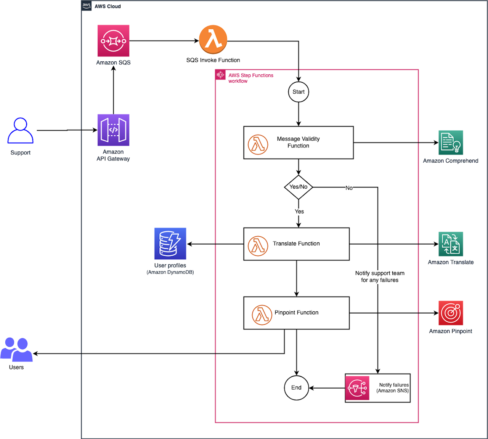
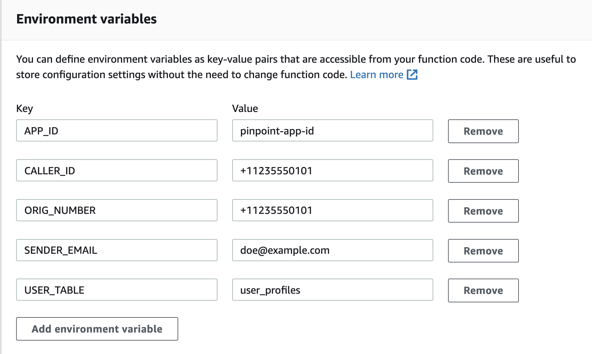

# Build a multi-language notification system using Amazon Translate and Amazon Pinpoint

## Overview

This project demonstrates how to develop a simple serverless multi-language notification system using AWS services such as Amazon Translate and Amazon Pinpoint. The system takes an input from the human user and sends notifications to the customers based on their preferred language and way of communication. 

The multi-language-notification-with-amazon-translate-amazon-pinpoint git repository contains the source code and supporting files that you can deploy with the SAM CLI.

Use the following git command to download the source code:

```bash
git clone git@github.com:aws-samples/multi-language-notification-with-amazon-translate-amazon-pinpoint.git
cd multi-language-notification-with-amazon-translate-amazon-pinpoint
```

The downloaded code includes the following files and folders:

- **functions** - This directory contains the code for the application's Lambda functions.
- **statemachine** - This directory contains the definition for the state machine that orchestrates the multi-language notification workflow.
- **template.yaml** - A template that defines the AWS resources used to build the system.

This system creates a multi-language notification workflow to translate text into various languages, converts it into voice, sms and email, and sends a notification to its users. It demonstrates the power of Step Functions to orchestrate Lambda functions, Amazon Translate, and Amazon Pinpoint to form complex and robust workflows.

Amazon Translate is a text translation service that uses advanced machine learning technologies to provide high-quality translation on demand. You can use Amazon Translate to translate unstructured text documents or to build applications that work in multiple languages.

Amazon Pinpoint is a flexible and scalable outbound and inbound marketing communications service. You can connect with customers over channels like email, SMS, push, voice or in-app messaging. Amazon Pinpoint is easy to set up, easy to use, and is flexible for all marketing communication scenarios. 

**Note**: 
- Amazon Translate has costs associated with the service after the Free Tier usage, please see the [Amazon Translate pricing page](https://aws.amazon.com/translate/pricing/) for details.
- Amazon Pinpoint has costs associated with the service after the Free Tier usage, please see the [Amazon Pinpoint pricing page](https://aws.amazon.com/pinpoint/pricing/) for details.

## Solution Architecture


## Setup and deploy the application

The Serverless Application Model Command Line Interface (SAM CLI) is an extension of the AWS CLI that adds functionality for building and testing serverless applications.

### Prerequisites 

* AWS CLI - Installed and Configured with a valid profile [Install the AWS CLI](https://docs.aws.amazon.com/cli/latest/userguide/cli-chap-install.html)
* SAM CLI - [Install the SAM CLI](https://docs.aws.amazon.com/serverless-application-model/latest/developerguide/serverless-sam-cli-install.html)
* Python - [Install Python 3.x](https://www.python.org/downloads/)
* Bash shell - For Linux and macOS, this is included by default. In Windows 10, you can install the [Windows Subsystem for Linux](https://docs.microsoft.com/en-us/windows/wsl/install-win10) to get a Windows-integrated version of Ubuntu and Bash.
### Deploy the application
Run the following command to deploy the template. The command below will package and deploy your application to AWS, with a series of prompts:

```bash
sam deploy --guided
```

* **Stack Name**: The name of the stack to deploy to CloudFormation. This should be unique to your account and region, and a good starting point would be something matching your project name.
* **AWS Region**: The AWS region you want to deploy your app to. The Region you select should support Amazon Pinpoint service. You can check all supported AWS services in a given region [here.](https://aws.amazon.com/about-aws/global-infrastructure/regional-product-services/)
* **Confirm changes before deploy**: If set to yes, any change sets will be shown to you before execution for manual review. If set to no, the AWS SAM CLI will automatically deploy application changes.
* **Allow SAM CLI IAM role creation**: Many AWS SAM templates, including this example, create AWS IAM roles required for the AWS Lambda function(s) included to access AWS services. By default, these are scoped down to minimum required permissions. To deploy an AWS CloudFormation stack which creates or modifies IAM roles, the `CAPABILITY_IAM` value for `capabilities` must be provided. If permission isn't provided through this prompt, to deploy this example you must explicitly pass `--capabilities CAPABILITY_IAM` to the `sam deploy` command.
* **Save arguments to samconfig.toml**: If set to yes, your choices will be saved to a configuration file inside the project, so that in the future you can just re-run `sam deploy` without parameters to deploy changes to your application.

### View the stack resources in the AWS console

You can now login to the [AWS console](https://aws.amazon.com/) and view the resources in the AWS CloudFormation console created by the sam deploy process. Navigate through each of the Lambda functions, and also the Step Functions workflow to understand how the system works.

### Register Email and Phone number using Amazon Pinpoint console

You will need to create an Amazon Pinpoint project using the AWS Management console as the system invokes the Pinpoint service to send the notifications to the customers. Here are the steps to configure the Pinpoint service.

- In the AWS Management console, choose the Pinpoint service from the Services menu or search bar.
- Select the region you have deployed the application in. 
- Enter a name to create project.
- Configure Email, SMS, and Voice features:

    - **[Email setup](https://docs.aws.amazon.com/pinpoint/latest/userguide/channels-email-setup.html)** 
        - Choose **Configure** in **Email** and enter a valid email address . 
        - In the **Set up email** page, choose the Verify button to verify the email address. This will send a verification link to the email address you specified.
        - After you verify the link in your email, choose the **Save** button.
        - _**Note** - You will have to register and verify both the recipient and the sender email addresses in Pinpoint._
    - **[SMS and Voice setup](https://docs.aws.amazon.com/pinpoint/latest/userguide/channels-sms.html)** 
        - In the left navigation pane of the console, choose **SMS and voice** and then choose **Phone numbers**.
        - In the **Phone numbers** page, choose **Request phone number**.
        - Choose the country you are in and choose **Next**. **Note** If you are in **United States**, you have the option to choose a Toll Free Number.  
        - In the **Review and request** page, choose **Request**. You should see a phone number created.
        - In the left navigation pane, choose **All projects** and choose the name of your project.
        - Choose **Settings** and then choose **General Settings**. 
        - Choose **SMS and voice** and choose **Edit** in the **SMS settings** pane.
        - In the **Set up SMS** page, select **Enable the SMS channel for this project** and then choose **Save changes**.

The Pinpoint project setup is complete.

### Update environment variables for the Pinpoint Lambda function

The Pinpoint Lambda function should be updated with the configuration variables that point to the Amazon Pinpoint project and also the phone numbers and email ids that you have setup in the above steps.

- In the AWS Management Lambda console, choose the Pinpoint Function and then choose the Configuration tab. Choose the Environment variables section and choose **Edit** to add the below variables and the values from the Amazon Pinpoint project console.

    - APP_ID -  the Pinpoint Project ID
    - CALLER_ID - the phone number you requested in Pinpoint
    - ORIG_NUMBER - the phone number you requested in Pinpoint
    - SENDER_EMAIL - the email id you registered and verified in Pinpoint
    - USER_TABLE - it is populated already, do not make any change

Here is a screenshot of the environment variables for the Pinpoint Lambda function after updates:



### Setup DynamoDB records to test the application

You will need to setup some user records in the DynamoDB table. The application will use these records for the preferred way of communication and also the users corresponding email address and phone numbers. So, make sure you enter a valid email address and phone number to receive the messages. Run the below inserts using **PartiQL** editor from DynamoDB console.

```sql
INSERT INTO user_profiles VALUE 
{  
    'event_id': 'Apr142022',
    'user_id': 'ui101',
    'first_name' : 'John',
    'email': 'john@example.com', --A valid email id to receive email
    'language' : 'en',
    'phone': '+11235550101', --A valid phone number number to receive the voice prompt
    'preference': 'email',
    'phoneme': 'en-US'
}

INSERT INTO user_profiles VALUE 
{
    'event_id': 'Apr142022',
    'user_id': 'ui102',
    'first_name' : 'Mary',
    'email': 'mary@example.com', --A valid email id to receive email
    'language' : 'de',
    'phone': '+11235550191', --A valid phone number number to receive the voice prompt
    'preference': 'sms',
    'phoneme': 'de-DE'
}

INSERT INTO user_profiles VALUE 
{  
    'event_id': 'Apr142022',
    'user_id': 'ui103',
    'first_name' : 'Arnav',
    'email': 'doe@example.com', --A valid email id to receive email
    'language' : 'fr',
    'phone': '+11235550190', --A valid phone number number to receive the voice prompt
    'preference': 'voice',
    'phoneme': 'fr-FR'
}
```

### Copy the API Gateway Endpoint URL

In the AWS Management console, choose the API Gateway service and then choose the API created by the sam deploy process. Copy the dev end point url from the **Stages** pane to use it for testing. 

Or, you can also copy the API Gateway endpoint url from AWS CloudFormation console, open the stack and copy the value from **Outputs** tab.


### Test the application

You are now ready to test your application!! You can test it using the curl command. 

Here is a sample json object to post in the body:

```json
{
    "englishTxt" : "The company is adding a new item to the menu, this will go live by May 10th. Please ensure you are prepared for this change and plan out accordingly.",
    "eventId": "Apr142022"
}
```

Here is the curl command to use:

```bash
curl -d '{json}' -H 'Content-Type: application/json' {API_GATEWAY_ENDPOINT}
```

You should receive a message back from the SQS queue similar to below:

```json
{
    "SendMessageResponse": {
        "ResponseMetadata": {
            "RequestId": "19809b83-46cf-5917-b30d-c11fd0c2d59c"
        },
        "SendMessageResult": {
            "MD5OfMessageAttributes": null,
            "MD5OfMessageBody": "fce2c5d78c337184743e5213ee76c92b",
            "MD5OfMessageSystemAttributes": null,
            "MessageId": "bbdeefe6-805b-4206-8dba-543f4571ce92",
            "SequenceNumber": null
        }
    }
}
```


### Result

You will receive a phone call, an email, and a voice message in various languages for the above message posted through the curl command. You can check the Step Functions state machine event that processed this message in the AWS console, and will see the workflow event in a succeeded state if all the above steps are setup correctly. 

Here is a screenshot of how the state machine workflow looks for a successfully processed message:


### Cleanup

To delete the sample application that you created, use the AWS CLI. Assuming you used your project name for the stack name, you can run the following:

- Pinpoint clean up:
    - Open AWS Pinpoint console, and select the project. In the left navigation pane, choose **Settings** and then choose **General settings**.
    - Choose **Delete project** and then enter `delete` to delete the project.
    - In the left navigation pane, choose **Email**, and then choose **Email identities**. Select the email identity you want to delete and then choose **Remove email identity**. Enter `delete` to delete the registered email address.
    - In the left navigation pane, choose **SMS and voice** and then choose **Phone numbers**. Select the phone number you want to delete and choose **Remove phone number**. Enter `delete` to delete the phone number.

- Delete the stack resources by using the following command in your terminal:

```bash
aws cloudformation delete-stack --stack-name <REPLACE_WITH_STACK_NAME>
```

### Blog Reference
[Building multi-language notification system using Amazon Translate and Amazon Pinpoint](https://aws.amazon.com/blogs/architecture/build-a-multi-language-notification-system-with-amazon-translate-and-amazon-pinpoint/) 

## Security
See [CONTRIBUTING](CONTRIBUTING.md#security-issue-notifications) for more information.

## License

This library is licensed under the MIT-0 License. See the LICENSE file.