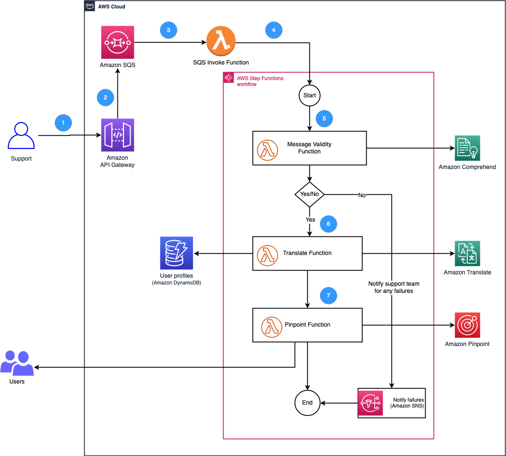

# Build a multi-language notification system using Amazon Translate and Amazon Pinpoint

## About
This project contains source code and supporting files for a multi-language notification system using Amazon Translate and Amazon Pinpoint that you can deploy with the SAM CLI. It includes the following files and folders.

- template.yaml - A template that defines the application's AWS resources.
- rep_flow_statemachine.json - AWS Step Functions state machine code, it includes all the steps needed to translate and send notifications


Important: This application uses
- Amazon Translate and there are costs associated with this service after the Free Tier usage, please see the   [Amazon Translate pricing page](https://aws.amazon.com/translate/pricing/) for details.
- Amazon Pinpoint and there are costs associated with this service after the Free Tier usage, please see the   [Amazon Pinpoint pricing page](https://aws.amazon.com/pinpoint/pricing/) for details.

### Blog Reference
[Building multi-language notification system using Amazon Translate and Amazon Pinpoint](https://aws.amazon.com/blogs/) 


## Solution Architecture



## Building and Deploying the application

### Requirements

* AWS CLI - Installed and Configured with a valid profile [Install the AWS CLI](https://docs.aws.amazon.com/cli/latest/userguide/cli-chap-install.html)
* SAM CLI - [Install the SAM CLI](https://docs.aws.amazon.com/serverless-application-model/latest/developerguide/serverless-sam-cli-install.html)
* [Python 3 installed](https://www.python.org/downloads/)
* The Bash shell. For Linux and macOS, this is included by default. In Windows 10, you can install the [Windows Subsystem for Linux](https://docs.microsoft.com/en-us/windows/wsl/install-win10) to get a Windows-integrated version of Ubuntu and Bash.

### Setup & Deploy
Download or clone this repository.

    $ git clone git@github.com:aws-samples/multi-language-notification-amazon-translate-amaon-pinpoint.git
    $ cd multi-language-notification-amazon-translate-amaon-pinpoint

To deeply the application, run `sam deploy`.

    $ sam depoloy


## How it works
* TODO
* TODO

### Sample DynamoDB record
```sql
insert into mln_tbl value {  
    'event_id': 'Mar142022',
    'user_id': 'ui101',
    'first_name' : 'Robert'
    'email_id': 'foo@example.com', --A valid email id to receive email
    'language' : 'es',
    'phone': '+11234567890', --A valid phone number number to receive the voice prompt
    'preference': 'email',
    'phoneme': 'es-MX'
}
```

### Cleanup

To delete the sample application that you created, use the AWS CLI. Assuming you used your project name for the stack name, you can run the following:

```bash
sam delete
```

## Security

See [CONTRIBUTING](CONTRIBUTING.md#security-issue-notifications) for more information.

## License

This library is licensed under the MIT-0 License. See the LICENSE file.